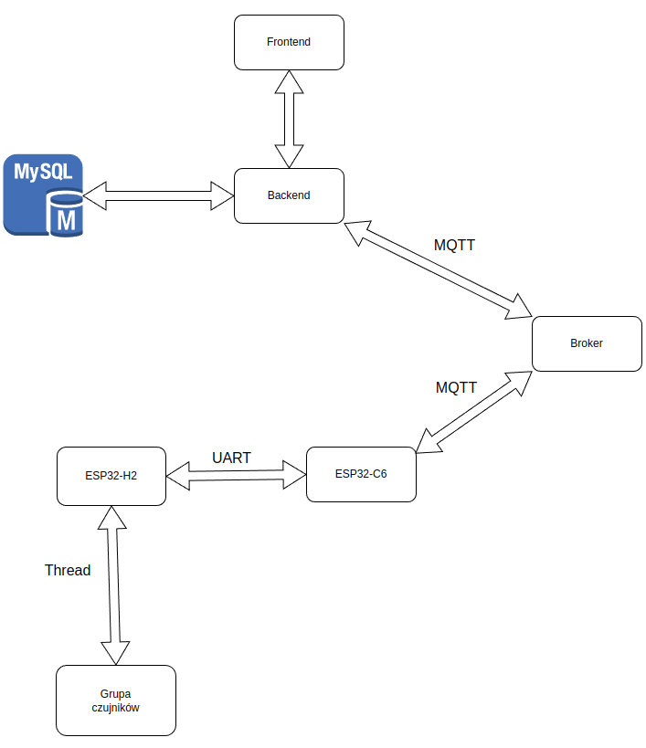
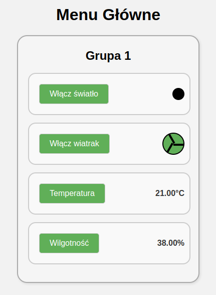
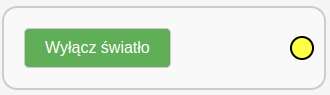
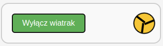
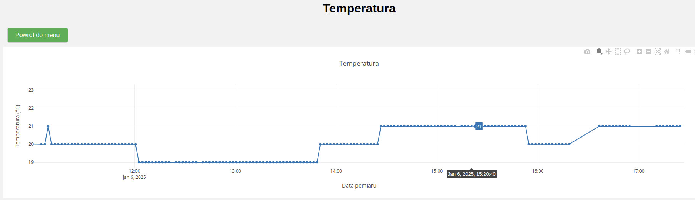
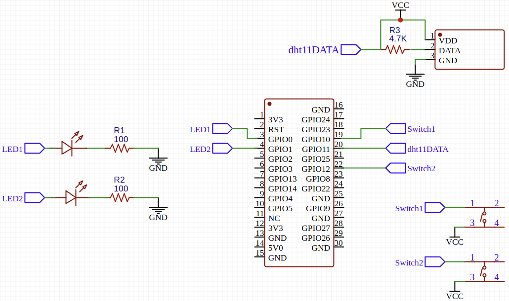
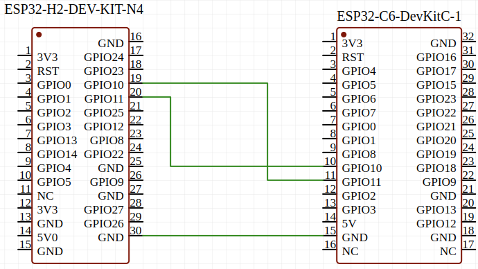

# Smart home control system project

This project shows the implementation of a smart home control system using ESP32 microcontrollers. Thread protocol was used for communication between microcontrollers. A custom border router was implemented, which acts as a gateway between the local network and the Internet. The control panel communicates with the local network using the MQTT protocol. The backend of the panel handles the database. Figure 1 shows the general scheme of communication in the system. 

  
  
<em>Fig. 1: Scheme of the system</em>

## Control panel
 The backend of the control panel was written using the Flask framework, and the technologies used in the frontend are HTML, CSS and JavaScript. The control panel is an SPA (Single Page Application), and the use of WebSocket protocol results in real-time operation and immediate response to new data. 

 The main menu of the control panel shows four blocks. Two of them relate to light and fan control. Changing the state of a device also changes the description of the block, as well as the appearance of the icon. The other two blocks are used to navigate to temperature and humidity graphs, and also display the last measurement in the main menu. 

 

  
  
  
  
  

## Hardware

The hardware part used:
- For the sensor group used: ESP32H2 which collects data from the dht11 sensor and monostable buttons to control the fan and light
- For the border router, ESP32H2 was used to communicate with the Thread network and ESP32C6 to communicate with the Internet

 

  
  

